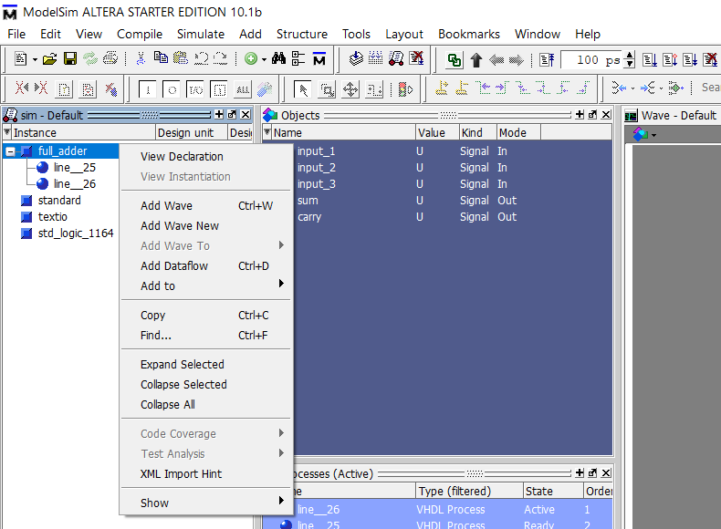
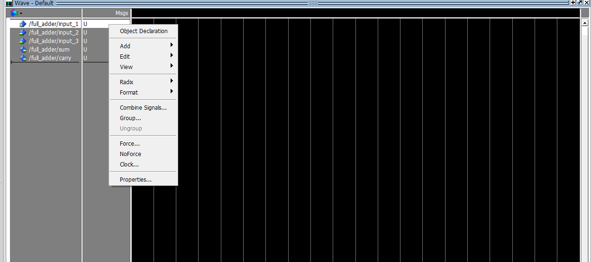
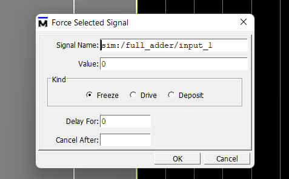
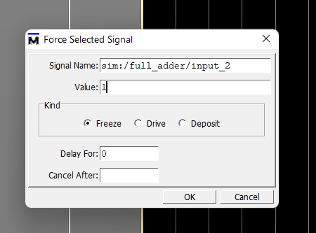
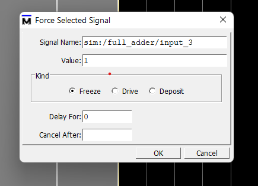
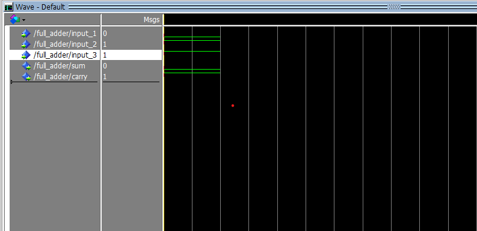

## FULL ADDER IN VHDL

The process of running the vhdl program is same for all the programs only thing thats different is the input providing procedure for each of the circuitary implementations. The guide for running the vhdl program is given at the readme of the main practical folder 

## PROCEDURE

Firstly run the program as it should be by creating the project file and then compiling the program. Then simulate the program then you will be welcomed with a screen as shown below

---

After this then right click on full_adder on the left side of the screen and add the wave

---

Now force the inputs as per your requirement 

---

The following are the possibilites of inputs there are 3 inputs A,B and C and there are two possible outputs S and C. Input the inputs seeing the table and then watch out for the specific output it generates

| A    | B    | C    | S    | C    |
| ---- | ---- | ---- | ---- | ---- |
| 0    | 0    | 0    | 0    | 0    |
| 0    | 0    | 1    | 1    | 0    |
| 0    | 1    | 0    | 1    | 0    |
| 0    | 1    | 1    | 0    | 1    |
| 1    | 0    | 0    | 1    | 0    |
| 1    | 0    | 1    | 0    | 1    |
| 1    | 1    | 0    | 0    | 1    |
| 1    | 1    | 1    | 1    | 1    |

Now suppose we take the inputs as 011 for the 3 inputs available then

---

Now run the program to get the output

From this example we can see that when the inputs are A: 0 B:1 and C:1 then the value of S and C are 0 and 1

---

