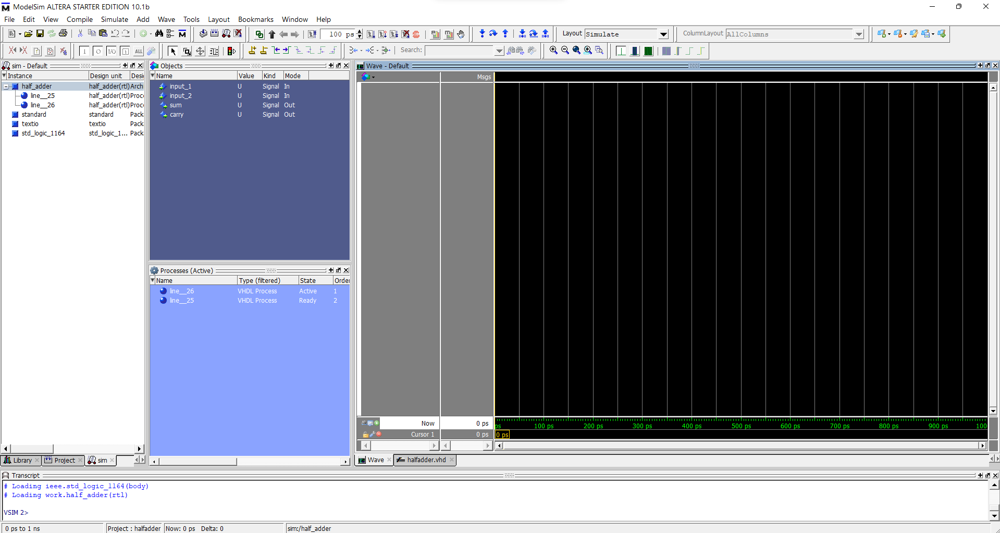
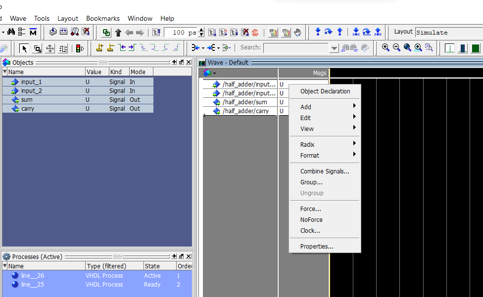

# <u>Half Adder in VHDL</u>

The process of running the vhdl program is same for all the programs only thing thats different is the input providing procedure for each of the circuitary implementations. The guide for running the vhdl program is given at the readme of the main practical folder

### PROCEDURE

Firstly run the program as it should be by creating the project file and then compiling the program. Then simulate the program then you will be welcomed with a screen as shown below

---

Right click on the half_adder on the left side of the screen and then click on add wave

---

After this force the inputs by right click on the msgs box

---

Force the inputs:

There are different possible inputs for the half adder which is shown below in a table

| A    | B    | S    | C    |
| ---- | ---- | ---- | ---- |
| 0    | 0    | 0    | 0    |
| 0    | 1    | 1    | 0    |
| 1    | 0    | 1    | 0    |
| 1    | 1    | 0    | 1    |

---

Click the run button or simply press F9 on the keyboard to run the code

---

Now you can get the waves shown below:

From this wave we can see in a half adder when both the inputs are low or 0 then sum and carry also is 0. We can get other inputs by manipulating the inputs by forcing them to either 0 or 1 then after manipulating the inputs simply click the run button or the F9 button and we will get another output according to the inputs provided we can see example below:

From this example we can see that when both the given inputs are 1 then the sum is zero and the carry is one which is correct for a half adder.

---

