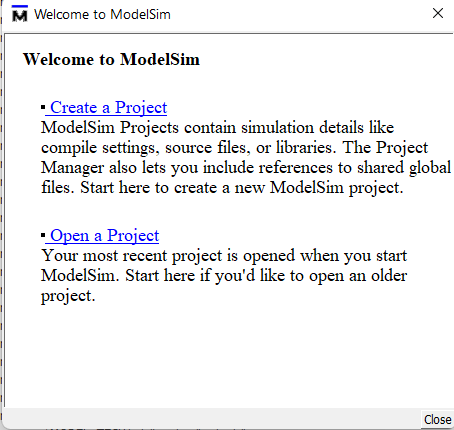
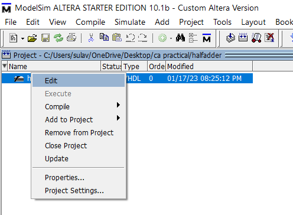
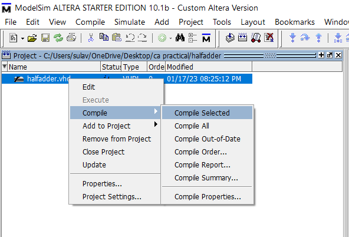
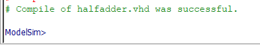
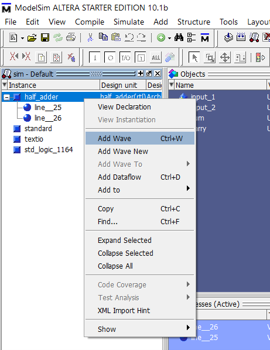
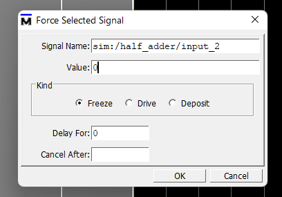
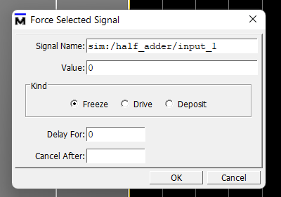
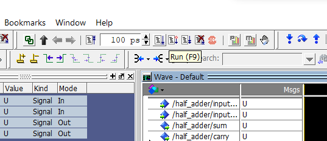
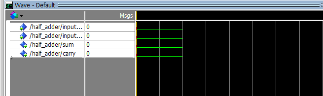
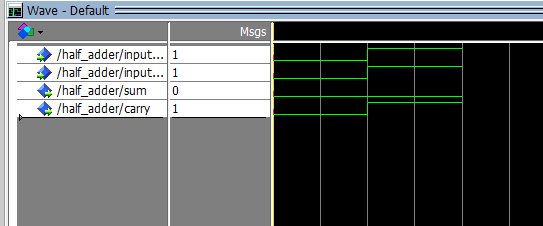

# <u>VHDL Programming</u>

---

## <u>Steps to run the program:</u>

###### 1. Create a project:

---

###### 2. Give a project name and a location for the project directory

---

###### 3. Create new file for writing the vhdl code

---

###### 4. Give a file name suppose halfadder

---

###### 5. After this a screen like this appears

---

###### 6. Right click on the mouse and click edit

---

###### 7. Write the code for the specific program

---

###### 8. Right click on the file above and then click compile selected

---

###### 9. If the compilation is successful then a success message appears at the bottom of the screen

---

###### 10. Start the simulation by hovering over simulate in the toolbar

---

###### 11. A dialog box appears and then choose your project

---

###### 12. After you click OK the following screen appears

---

###### 13. Right click on the half_adder on the left side of the screen and then click on add wave

---

###### 14. After this force the inputs by right click on the msgs box

---

###### 15. Force the inputs:

---

###### 16. Click the run button or simply press F9 on the keyboard to run the code

---

###### 17. Now you can get the waves shown below:

From this wave we can see in a half adder when both the inputs are low or 0 then sum and carry also is 0. We can get other inputs by manipulating the inputs by forcing them to either 0 or 1 like in step 15 and then after manipulating the inputs simply click the run button or the F9 button and we will get another output according to the inputs provided we can see example below:

From this example we can see that when both the given inputs are 1 then the sum is zero and the carry is one which is correct for a half adder.

---

